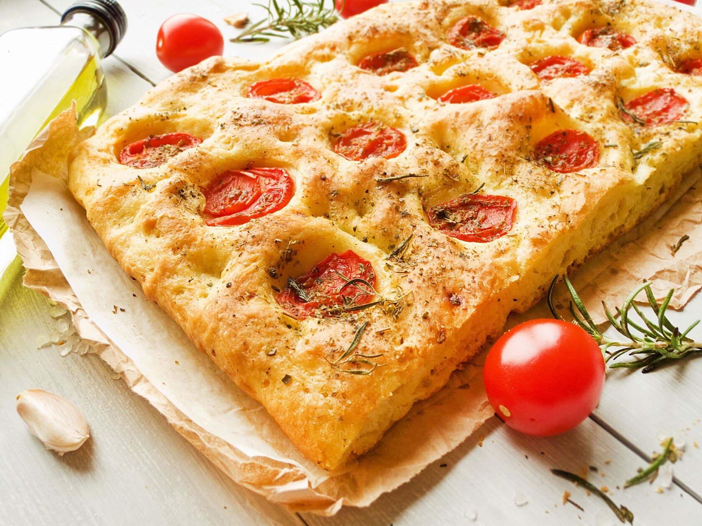

# Focaccia

Repas sans rien, repas de pain.

## Ingredients

- 300 g de farine
- 220 ml d'eau tiède
- 100 ml d'huile d'olive
- 25 ml d'huile d'olive
- 5g de levure instantanée
- 3 branches de romarin
- 2 gousses d'aïl
- Thym
- Sel

## Préparation

### La garniture

1. Mettre la moitié des 100ml d'huile dans un bol.
2. Emincer l'ail finement et ajouter au bol.
3. Ajouter les herbes.
4. Mélanger à la cuillère et laisser macérer.

### La pâte

1. La farine dans le bol.
2. Eau tiède (35°C), ajouter la levure et foutter.
3. Laisser réactiver pendant 15 minutes.
4. Ajouter le sel, la levure et les 25 ml d'huile d'olive à la farine.
5. Fouetter la pâte à la machine.
6. Mélanger avec la marise.
7. Ajouter de l'huile et mélanger à la main.
8. Laisser lever pendant une heure avec un chiffon pour recouvrir.

### Le moule

1. Huiler le moule à la main.
2. Avec les mains huilées, faire tomber la pâte dans le bol par élasticité.
3. Ajouter la pâte au bol.
4. Egaliser avec les doigts.
5. Laisser lever une heure avec le chiffon.

### L'enfournage

1. Crever la pâte avec les doigts huilés.
2. Parsemer l'ail et les herbes à la fourchettes sur la surface.
3. Ajouter un peu d'huile et du sel en bonus.
4. Mettre au four préchauffé à 230°C pendant 25 minutes.

### Déloulage

1. Enlever le pain à la spatule sur une planche.
2. Couper des tranches carrées et remplir l'assiette.
