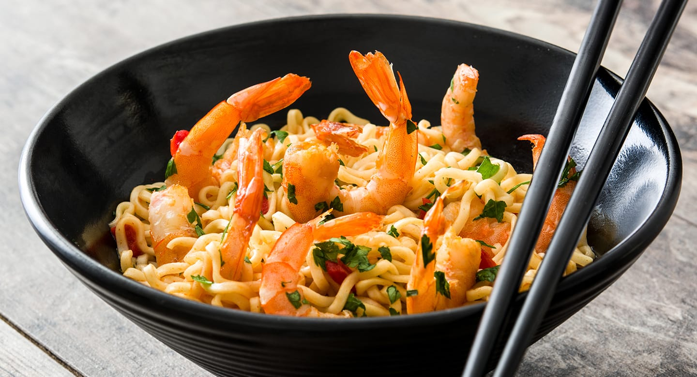

# Nouilles sautees

## Ingredients

- [ ] crevettes blanches 9
- [ ] nouilles aux oeufs 380g
- [ ] oignons verts 2
- [ ] 1 oignon
- [ ] feve germee 125g
- [ ] 10g sucre
- [ ] huile arachide 60 ml
- [ ] eau 15ml
- [ ] sauce huitre 15ml
- [ ] sauce soja sans sel 20ml
- [ ] sauce soja salee 15ml
- [ ] huile de sesame grillee 5ml

## Preparation

- oignon cisele en lamelle
- oignon vert coupé moyen
- sauce sucre, eau, sauce soja, sauce d'huitre, melanger.
- plonger nouilles eau bouillantes et attendre 2 min a partir de la re- [ ]ebullition.
- reserver nouilles dans un plat a gratin
- chauffer wok a 250 degre celsius
- huiler et ajouter oignons, crevettes, attendre 30 sec, ajouter oignons verts, huiler, tourner pendant 4 min
- reserver dans une assiette
- huiler le wok 30ml, ajouter les nouilles, huiler sur le cote, faire frire, huiler, ajouter les feves germees
- combiner l'assiette aux nouilles, ajouter la sauce
- huile de sesame griller
- dresser les nouilles et lez crevettes autour
