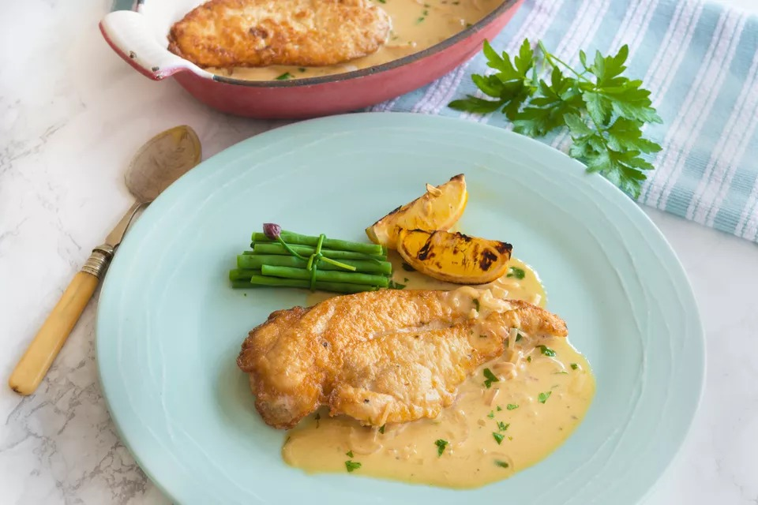

# Poulet à la française

## Ingrédients

- [ ] 3 Poitrines de poulet
- [ ] 3 choux-fleurs
- [ ] Oeufs
- [ ] Farine
- [ ] 1 bouteille Vin blanc
- [ ] Graisse de poulet
- [ ] 2 Citrons
- [ ] Origan
- [ ] Huile a l'ail

## Préparation

- Couper les choux-fleurs en morceaux. Garder la base pour un potage. Couper en deux les morceaux. Quantité: un gros bol.
- Sauce mayo legere pour le choux-fleurs: 1 oeuf, 1 c.a.s. de moutarde, 1 demi citron, sel, poivre. Mixer. Ajouter de l'huile d'olive. Mixer. Mettre au frais.
- Avec un couteau type boucher, enlever le filet de poulet. Couper la poitrine en deux horizontalement. Reserver sur une assiette.
- Laver la planche.
- Couper un citron en tranches.
- Faire la sauce pour le poulet: 4 oeufs, sel, poivre, 1 c.a.s huile d'olive. Mixer. Verser dans un plat.
- Mettre la farine dans un second plat. Epicer, melanger.
- Tremper le poulet dans la farine.
- Faire chauffer une grande poele a 170degC. Ajouter un fond d'huile. Tremper le poulet dans la sauce. Mettre dans la poele et cuire 2 minutes de chaque cote. Reserver et continuer avec le restant.
- Verser le reste d'huile dans un recipient.
- Ajouter du beurre dans la poele. Citron. Huile a l'ail. Mettre les citrons sur les morceaux de poulet. Ajouter le vin et la graisse dans la poele, laisser reduire, ajouter l'origan.
- Remettre le poulet dans la poele avec une pince.
- Ajouter la sauce aux choux-fleurs. Melanger.
- Dresser.
