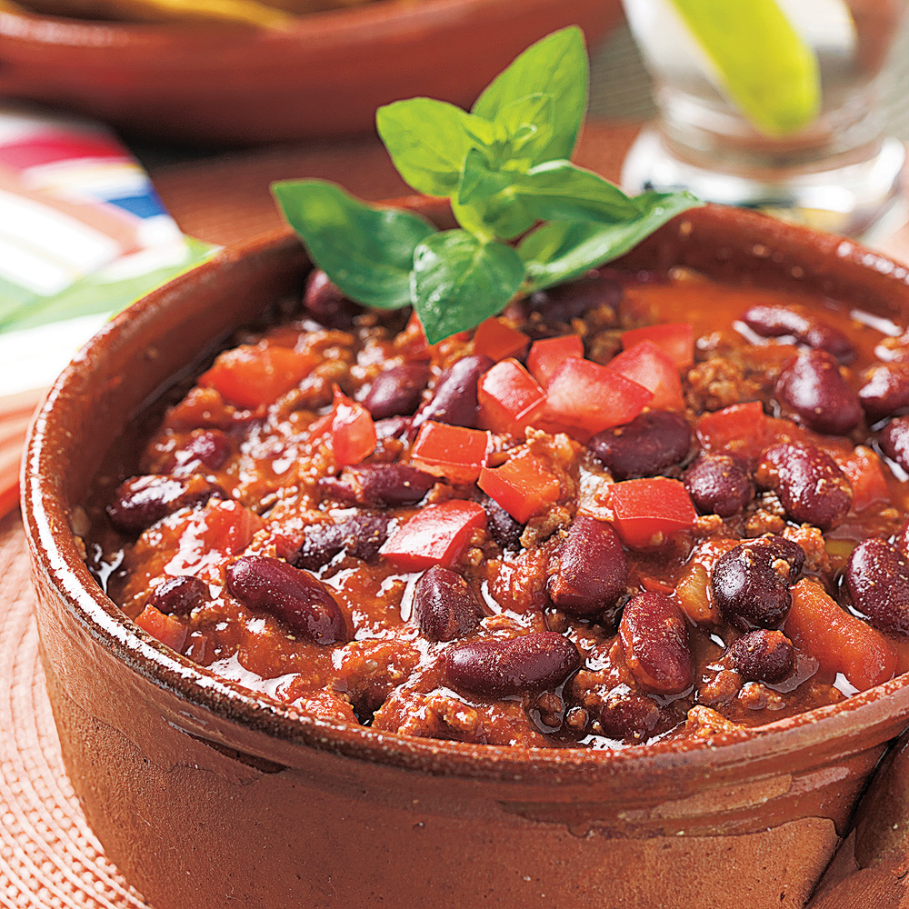

- [ ] macreuse de boeuf angus 3a
- [ ] haricots rouges
- [ ] jalapenio
- [ ] poivrons rouges
- [ ] piments rouges
- [ ] oignons rouges
- [ ] ail
- [ ] bouquet garni: thym, laurier 

- [ ] Mouiller les haricots a hauteur. Faire bouillir.
- [ ] Couper en dés les légumes.
- [ ] Faire bouillir les haricots 8 min. Rincer a l'eau froide. Mettre le thym et laurier dans la casserole. Mouiller a hauteur (eau froide). Reserver.
- [ ] Mixer l'ail. Dans le bol. Reserver les legumes.
- [ ] Couper la viande en tranches. Puis couper en dés.
- [ ] Saisir la viande sans huile dans une poele. Quand elle donne son jus, arraignée et on la met dans une casserole.
- [ ] Faire suer les legumes dans le jus de la viande. Paprika,cumin. Ajouter deux louches de bouillon. Sel, issou. 
- [ ] Verser les légumes dans la casserole avec la viande. Ajouter le coulis de tomates, ajouter le tomates en dés. Feu a fond.
- [ ] Cuire 1h30 quand ca commence a bouillir.
- [ ] Apres 30 min, haricots, feu a fond, cuire 1h.
- [ ] Ajouter sucre de canne dans viande, chocolat noir (peu). Basilique. Sel.
- [ ] Controler des haricots et viande.
- [ ] Melanger haricots et reste.
