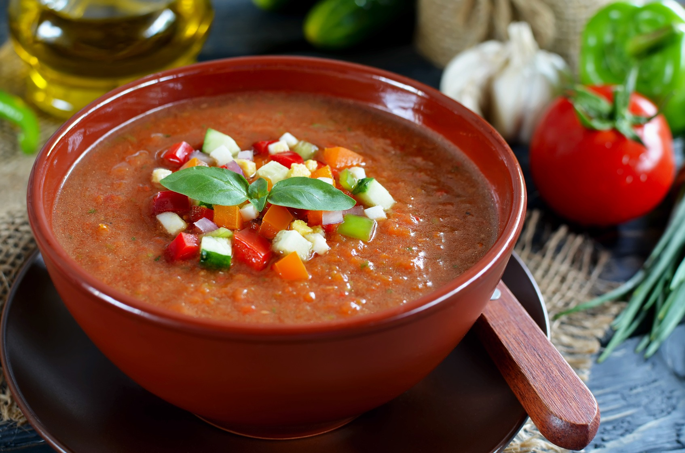

**Gaspacho froid - Recette pour 4 portions**

_Ingrédients :_

- [ ] 1 citron
- [ ] 1 concombre
- [ ] vinaigre de vin rouge
- [ ] huile d'olive
- [ ] 1 gousse d'ail
- [ ] 1 oignon rouge
- [ ] 1 poivron rouge
- [ ] 1 poivron vert
- [ ] 500 ml de jus/purée de tomates.
- [ ] 500 ml de tomates concassées mixées
- [ ] 1 piment fort
- [ ] Basilic frais ou menthe, pour la décoration
- [ ] Capucines comestibles, pour la décoration (facultatif)
- [ ] Sel fin, au goût

_Instructions :_

1. Préparation de l'assaisonnement :
   - Coupez un citron en deux, puis pressez- le pour en extraire le jus. Réservez dans un bol.
   - Épluchez une gousse d'ail. Ajoutez- la dans le bol contenant le jus de citron.

- Hachez la menthe et le basilic frais, puis ajoutez- les dans le bol.
- Huile d'olive, vinaigre rouge.
- Un peu de jus de tomate (en plus?).
- Machine miracle.
- Préparation dans le bol.

2. **Préparation des légumes :**

   - Coupez un oignon rouge en fines lamelles. Placez- les dans un grand bol.
   - Coupez un concombre en fines lamelles, puis hachez- le en petits morceaux. Ajoutez- le dans le bol.
   - Faites de même avec les poivrons vert et rouge : coupez- les en fines lamelles, puis en petits dés, et ajoutez- les dans le bol.

3. **Préparation du gaspacho :**

   - Ajoutez 500 ml de tomates concassée mixées dans le bol contenant les légumes coupés.
   - Versez 300 ml de jus de tomates.
   - Mélangez bien, puis ajoutez le reste de jus de tomate.
   - Assaisonnez avec du sel fin, une cuillère à café de vinaigre de vin rouge, et une cuillère à soupe d'huile d'olive.
   - Mélangez le tout.

4. **Réfrigération :**

   - Couvrez le bol avec un film plastique et placez- le au réfrigérateur pendant environ 30 minutes.

5. **Service :**
   - Sortez le gaspacho du réfrigérateur, retirez le film plastique.
   - Servez dans des bols, et décorez avec une feuille de basilic frais, une feuille de menthe, ou des capucines comestibles.
   - Ajoutez un léger filet d'huile d'olive et un trait de vinaigre pour parfaire la présentation.
