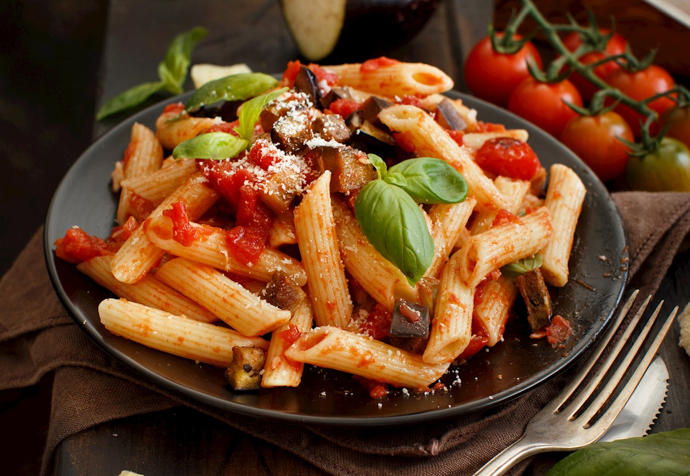

# Recette des pâtes à la sicilienne (pasta alla Norma)

## Ingrédients pour 2 personnes:

- [ ] Penne rigate ou gnocchi – 160 g
- [ ] Aubergines – 1
- [ ] Ricotta salée – 100 g
- [ ] Basilic – 6 feuilles environ
- [ ] Tomates pelées – 300 g
- [ ] Ail – 1 gousse
- [ ] Huile d’olive vierge extra
- [ ] Sel

## Ustensiles

- Passoir
- Mixeur

## Préparation:

1. Lavez l'aubergine, ôtez les extrémités, puis coupez-la en rondelles de 4 mm d’épaisseur. Mettez-les dans une passoire, saupoudrez-les de gros sel, et pressez-les sous un poids pendant une heure pour éliminer l'eau.
2. Préparez la sauce tomate: faites dorer la gousse d’ail dans un fond d’huile, ajoutez les tomates pelées, laissez mijoter, mixez la sauce, puis faites-la cuire jusqu’à épaississement. Ajoutez la moitié des feuilles de basilic frais.

3. Rincez l'aubergine, faites-la frire à la poêle dans de l’huile de friture, puis égouttez-la sur du papier absorbant. Faites cuire les pâtes dans de l'eau bouillante salée et râpez la ricotta.

4. Recoupez l'aubergine, faites-la revenir dans une poêle avec de la sauce tomate. Ajoutez les pâtes égouttées al dente, mélangez à feu doux. Servez dans des assiettes, recouvrez de sauce tomate, décorez avec les tranches d’aubergine, saupoudrez de ricotta et garnissez de feuilles de basilic frais.

