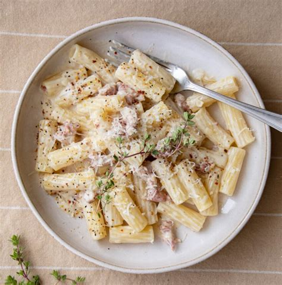

### Ingrédients

Pâtes alla Norcina

- [ ] 2 c. à soupe d'huile d'olive extra vierge
- [ ] 1/2 gousse d'ail, pelée et écrasée
- [ ] 200g de saucisse de porc italienne, émiettée
- [ ] 75ml de vin blanc sec
- [ ] 100ml de crème liquide
- [ ] 200g de pâtes courtes, telles que des penne ou des rigatoni
- [ ] 25g de Pecorino Romano râpé
- [ ] sel fin
- [ ] poivre noir fraîchement moulu

### Méthode

1. Porter une grande casserole d'eau salée à ébullition.
2. Pendant ce temps, chauffer l'huile et l'ail dans une grande poêle à feu moyen. Une fois que l'huile est chaude mais pas fumante et que l'ail est parfumé, ajouter la saucisse émiettée.
3. Faire dorer la saucisse, en remuant et en raclant tout le temps avec une spatule en bois pour éviter qu'elle ne colle et ne brûle.
4. Ensuite, retirer l'ail et verser le vin. Laisser évaporer tout en continuant à racler le fond de la poêle. Baisser le feu, couvrir et finir de cuire la saucisse dans son propre jus pendant 10 minutes.
5. Découvrir, goûter et assaisonner. Verser la crème et porter la sauce à frémissement. Réduire pendant 3 à 4 minutes, puis éteindre le feu, couvrir et réserver.
6. Cuire les pâtes dans de l'eau bouillante salée jusqu'à ce qu'elles soient al dente. Égoutter et ajouter à la poêle avec la saucisse et la sauce à la crème. Placer la poêle sur un feu doux et mélanger les pâtes pour les enrober uniformément de sauce - [ ] vous pouvez diluer la sauce avec un peu d'eau de cuisson des pâtes si vous la trouvez trop épaisse.
7. Saupoudrer généreusement les pâtes dans l'assiette avec du Pecorino râpé et du poivre noir fraîchement moulu avant de servir.

