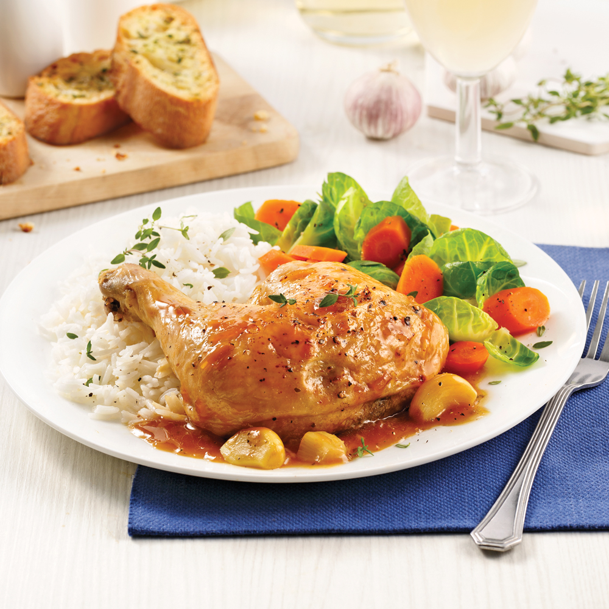

**Recette de Poulet aux 40 Gousses d'Ail**

**Ingrédients :**

- [ ] 30 à 40 gousses d'ail (selon la taille)
- [ ] 1 citron
- [ ] Environ 50 g de beurre
- [ ] 20 à 30 ml d'huile neutre
- [ ] 250 ml de vin blanc sec
- [ ] 250 ml de crème de cuisson 35 %
- [ ] Ciboulettes à volonté
- [ ] Environ 3 branches de thym
- [ ] 3 morceaux de poulet (cuisses et pilons)
- [ ] Cognac (pour flamber, à volonté)
- [ ] Vin blanc sec (pour déglacer)
- [ ] Sel et poivre

**Étapes :**

1. **Préparation du poulet :**

   - Sur une planche, placez le poulet côté peau en bas.
   - Trouvez le gras et coupez a cet endroit. Retirez l'excès de gras.
   - Répétez pour chaque morceau. Réservez cuisse et pilon.

2. **Cuisson du poulet :**

   - Faites chauffer une poêle à feu vif. Ajoutez l'huile neutre.
   - A 150degC, saisissez le poulet côté peau en dessous, environ 2-3 minutes de chaque côté, jusqu'à ce qu'il soit bien doré.

3. **Ajout de l'ail et du beurre :**

   - Réduisez le feu à moyen. Ajoutez les gousses d'ail autour du poulet.
   - Ajoutez le beurre, répartissez-le bien pour couvrir l'ail.Attention pas bruler le beurre.

- Couvrez et laissez cuire à feu doux pendant environ 15 minutes. A mi-cuisson, retournez le poulet.

4. Entre temps :

- Couper la ciboulette finement.
- Rouler le citron avec la paume de la main pour en extraire le jus. Couper en deux.

5. **Flambage et déglacage :**

   - Après 15 minutes, retournez le poulet.
   - Ajoutez un peu de cognac et faites flamber.
   - Ajoutez le vin blanc sec pour déglacer la poêle, en grattant les sucs de cuisson, sans ecraser l'ail. Faites réduire.

6. **Cuisson finale :**

   - Ajoutez les branches de thym, couvrez et laissez cuire encore 15 minutes.

7. **Préparation de la sauce :**

   - Dans une casserole, faites chauffer la crème à feu moyen sans la faire bouillir, juste frémir.

- Le poulet a fini de cuire, retirez-le de la poêle et garnissez avec quelques gousses au choix.
- Ajoutez les gousses d'ail confites a la creme, sur un feu moyen, remuez, pressez le citron, et écrasez-les pour obtenir une sauce homogène ou utilisez un mixeur plongeant.
- Salez et poivrez.

8. **Assemblage et dressage :**

   - Disposez le poulet sur une assiette, ajoutez les gousses d'ail confites autour.
   - Versez la sauce par-dessus.
   - Ajoutez les ciboulettes finement hachées pour décorer.

9. **Suggestions d'accompagnement :**
   - Servez avec une purée de pommes de terre pour accompagner ce plat riche en saveurs.
