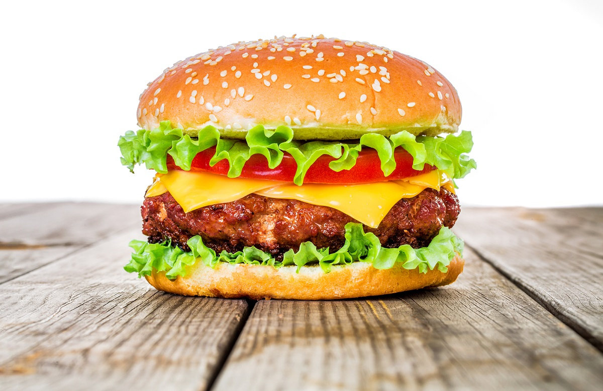

6 personnes

- [ ] boeuf haché 200gx6
- [ ] Pain
- [ ] vieux Cheddar 2 tranchesx6
- [ ] fromage 2 tranchesx6
- [ ] oeuf x6
- [ ] huile 1 verre
- [ ] oignon x6

matos
1 assiette viande
1 assiette pain
1 saladier oignon
1 grosse planche
1 spatule
2poeles
1 cuillerre beurre
1 pince pour la viande

1. Sauce
   oeuf
   huile végétale
   harissa 1c à soupex6
   mixer le tout
   mettre au frais

2. Cuisson
   feu à fond
   beurre
   égaliser oignon
   retourne oignon
   viande décoller
   viande sel
   tourner viande pince
   après 5 min cognac sur la viande

3. montage
   tranche pain
   tartiné
   2 tranches fromage en étoile
   steak
   oignon
   fromage
   pain tartiné
   beurre

4. cuisson finale
   feu à fond
   coté beurre
   beurré le dessus
   tourner à la spatule

5. presentation
   coupé en deux sur une assiette
