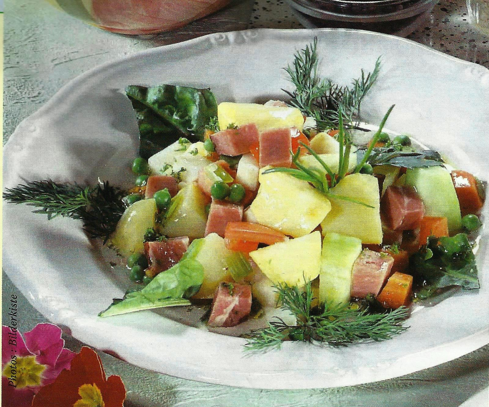

Voici la recette en Markdown avec des checklist pour les ingrédients.

## Recette : Salade de Pommes de Terre - Trois Façons

### Ingrédients

#### Pommes de Terre (Base)

- [ ] Pommes de terre aux couleurs bleu, blanc et rouge
- [ ] Eau 3l (couvrir les pommes de terre)
- [ ] Sel (30g)
- [ ] Poivre du moulin

#### Sauce Mayonnaise (Base)

- [ ] 1 oeufs
- [ ] Moutarde de Dijon
- [ ] Vinaigre de vin rouge
- [ ] Huile
- [ ] Sel et poivre

#### Version 1 : Classique

- [ ] Pommes de terre cuites
- [ ] Mayonnaise maison
- [ ] Ciboulette hachée
- [ ] fenouil

#### Version 2 : Crème Sure et Bacon

- [ ] Crème sure
- [ ] Moutarde de Meaux
- [ ] Ciboulette
- [ ] Oignons marinés
- [ ] Bacon croustillant
- [ ] Noix grillées

#### Version 3 : Fromage et Curry

- [ ] Fromage orange râpé
- [ ] Curry en poudre
- [ ] Oignons verts
- [ ] Persil haché
- [ ] Bacon croustillant

### Instructions

1. **Cuisson des pommes de terre**

   - Couper les pommes de terre en morceaux.
   - Faire bouillir dans de l'eau salée, et quand ca boue cuire pendant 15 minutes.
   - Égoutter et laisser refroidir.

2. **Oignons marinés**
   - 1 Oignon rouge en lamelle
   - Vinaigre de xeres avec oignons
3. **Cornichons marinés**
   - Cornichons julienne puis dés.
4. **Poitrine**
   - Poitrine fumée en tranche puis en dés.
