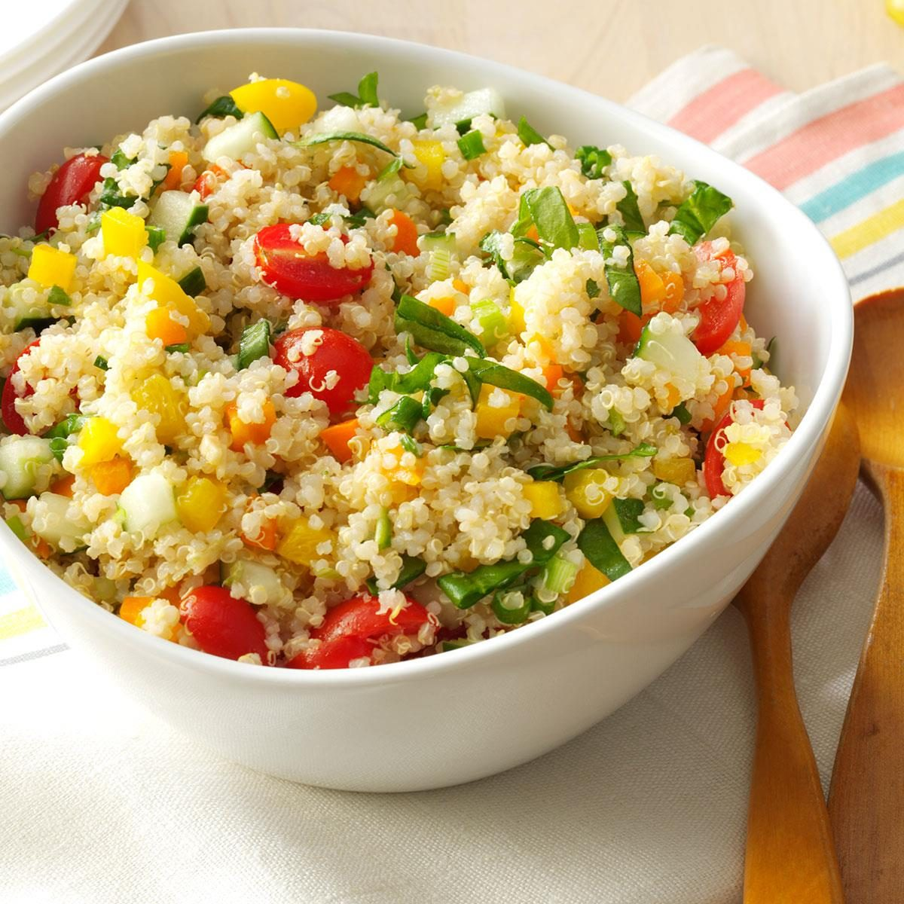

### Salade de Lentilles et Quinoa aux Carottes et Citron

en plus: saumon cuit a la poele 2-3 min de chaque coté

#### Ingrédients :

- [ ] **Ail**
- [ ] **Carotte** 1
- [ ] **Ciboulette**
- [ ] **Citron** : 3
- [ ] **Coriandre fraîche**
- [ ] **Cumin moulu**
- [ ] **Feuilles de laitue** : pour la décoration
- [ ] **Huile d'olive**
- [ ] **Lentilles** (type automnale, 3 couleurs: orange, jaune et brunes) : 500 g
- [ ] **Mesclun de fleurs** : pour la décoration
- [ ] **Moutarde de Dijon**
- [ ] **Oignon rouge** : 2
- [ ] **Persil frais**
- [ ] **Poivre**
- [ ] **Quinoa** (trois couleurs : rouge, blanc et noir) : 500 g
- [ ] **Sel**

#### Instructions :

1. **Condiments**

   - Hacher très finement le persil et mettre dans récipient a creme caramel.
   - Hacher très finement la coriandre et mettre dans récipient a creme caramel.
   - Hacher très finement la ciboulette et mettre dans récipient a creme caramel.
   - Hacher l'oignon et réserver.
   - Hacher l'ail et réserver.
   - Raper les carottes.

2. **Cuisson des lentilles ** :

   - Faire bouillir 1/2 litre d'eau non salée.
   - Ajouter les lentilles, remuer et cuire pendant 13 minutes.
   - Pendant ce temps, faire la sauce
   - Cuire le quinoa selon les instructions du paquet (environ 13-15 minutes).
   - Égoutter les lentilles et le quinoa, les rincer à l'eau froide pour stopper la cuisson, et les laisser refroidir.

3. **Préparation de la sauce citron** :

   - Couper les citrons en deux.
   - Prendre un grand bol, mettre un chinois dessus, et presser les citrons.
   - Ajouter 3 bonnes c-a-s de moutarde.
   - Ajouter 1 c-a-s de sel, 1 c-a-c de poivre et fouetter la sauce pour mélanger.
   - Incorporer progressivement l'huile d'olive en fouettant pour obtenir une émulsion.
   - Ajouter 3 c-a-s de persil, coriandre, et ciboulette. Mélanger bien.
   - Ajouter 1 bonne c-a-c de cumin.
   - Monter le tout à l'huile d'olive (250ml)

4. **Quinoa** :

   - Ajouter le quinoa a la casserole.
   - Cuire les lentilles et le quinoa encore 13 minutes.
   - Egoutter avec un mich?? une passoire-louche et mettre dans une casserole d'eau glacée.

5. **Assemblage de la salade** :

   - Ajouter la sauce aux lentilles-quinoa et remuer avec une marise.
   - Egrainer avec des gants en plastique.

6. **Dressage** :

   - Mesclun autour.
   - 1 feuille de salade au centre.
   - Disposer le plat avec une cuillère dans la feuille de salade.
   - Vinaigrette par-ci par-la.
   - 1 feuille de menthe du jardin.

7. **Service** :
   - Servir immédiatement ou réfrigérer pour servir frais.

Bon appétit ! N'hésitez pas à ajuster les ingrédients selon vos préférences personnelles.
