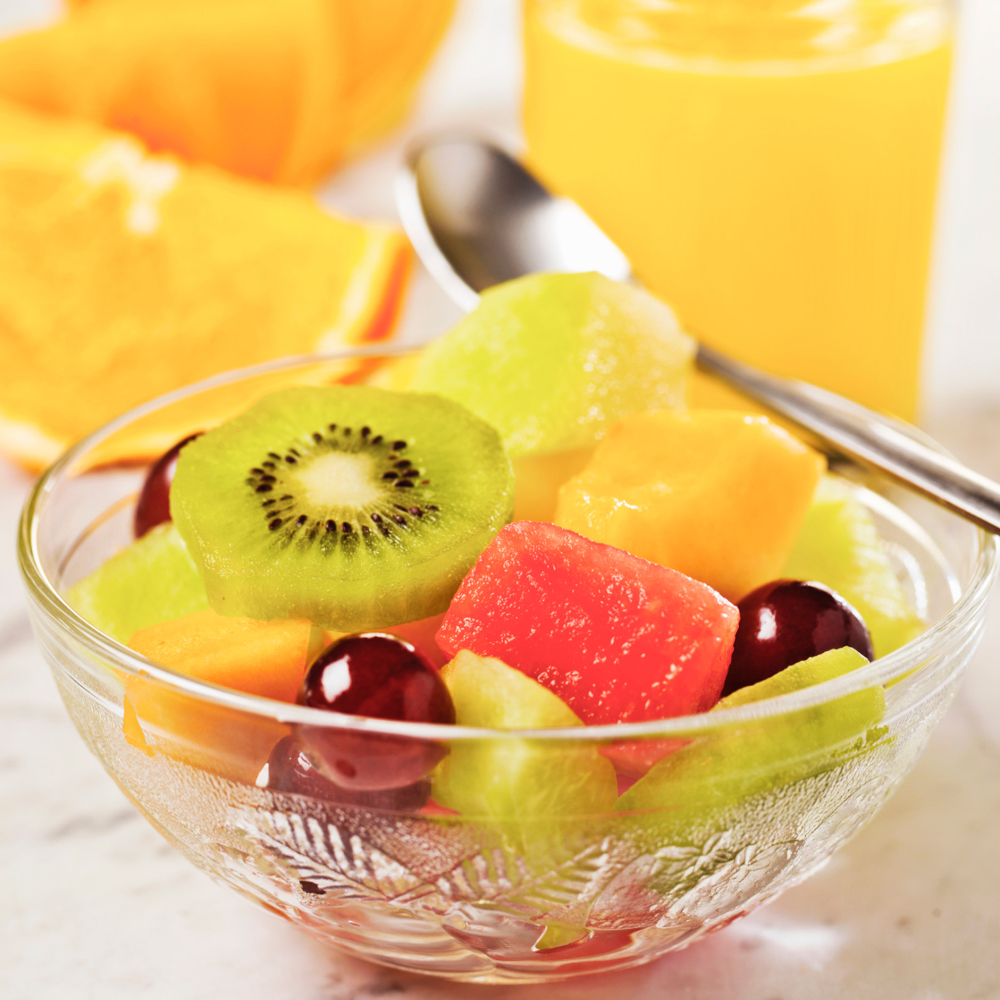

### Ingrédients

- [ ] Fraises
- [ ] Banane
- [ ] Pamplemousse
- [ ] Kiwi
- [ ] Fruit du dragon
- [ ] Cerises
- [ ] Melon
- [ ] Bleuets (myrtilles)
- [ ] Framboises noires
- [ ] Sucre d'érable (optionnel)

### Ustensiles

- Petit couteau
- Cuillère
- Fourchette
- Bol

### Préparation

1. **Préparation des Fraises**

   - Lavez les fraises et utilisez un petit couteau pour faire une incision afin de créer une "fleur". Réservez les fraises.

2. **Préparation de la Banane**

   - Coupez les extrémités de la banane. Placez la banane horizontalement et réalisez une incision longitudinale. Utilisez une fourchette pour maintenir la banane et une cuillère pour enlever la peau. Coupez ensuite la banane en rondelles et réservez.

3. **Préparation du Pamplemousse**

   - Utilisez un petit couteau pour couper le pamplemousse. Enlevez la peau et les membranes pour ne garder que les suprêmes (segments de pamplemousse). Réservez.

4. **Préparation du Kiwi**

   - Coupez les extrémités du kiwi, puis pelez-le en utilisant une cuillère pour séparer la chair de la peau. Coupez ensuite le kiwi en morceaux et réservez.

5. **Préparation du Fruit du Dragon**

   - Coupez le fruit du dragon en deux. Utilisez une cuillère pour enlever la chair, puis coupez-la en morceaux. Réservez.

6. **Préparation des Cerises**

   - Équeutez et dénoyautez les cerises. Coupez-les en deux et réservez.

7. **Préparation du Melon**

   - Coupez le melon en deux et enlevez les graines. Utilisez une cuillère à melon pour faire des boules. Réservez.

8. **Assemblage de la Salade de Fruits**
   - Dans un grand bol, mélangez les fraises, les rondelles de banane, les suprêmes de pamplemousse, les morceaux de kiwi, le fruit du dragon, les cerises, les boules de melon, les bleuets et les framboises noires.
   - Saupoudrez légèrement de sucre d'érable pour un goût sucré naturel (optionnel).
   - Mélangez délicatement avec une cuillère et une fourchette pour bien répartir les fruits sans les écraser.

### Présentation

- Disposez la salade de fruits dans un bol de service.
- Pour une touche décorative, ajoutez quelques fleurs de fraises sur le dessus.
- Servez immédiatement pour profiter de la fraîcheur des fruits.

### Conseils

- Pour une salade de fruits encore plus rafraîchissante, placez le bol au réfrigérateur pendant une heure avant de servir.
- Vous pouvez ajouter des feuilles de menthe fraîche pour une note herbacée et une belle présentation.
